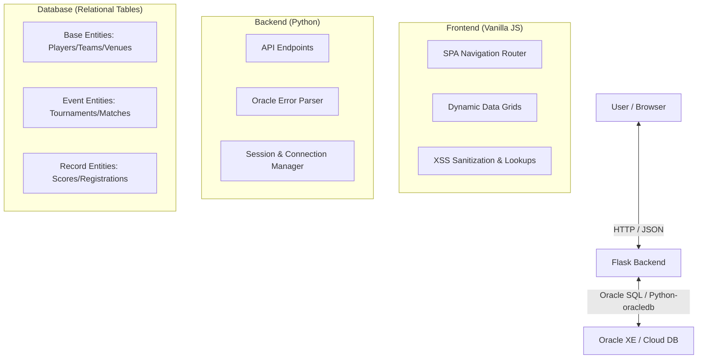
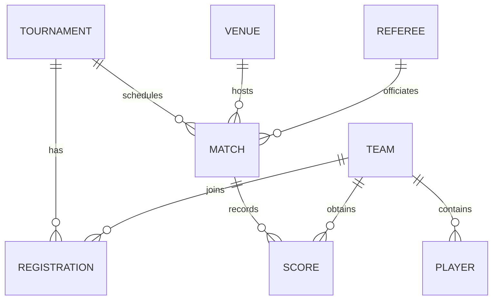

# Sports Tournament Management System: Formal Report

**Prepared by:** [Your Name / System Architect]  
**Date:** March 28, 2026

---

## 📋 Table of Contents

1.  [Abstract](#1-abstract) ..................................................................................... 1
2.  [Introduction](#2-introduction) ............................................................................... 2
3.  [Existing Work](#3-existing-work) ............................................................................. 3
4.  [Proposed System](#4-proposed-system) ..................................................................... 4
5.  [System Design / Architecture](#5-system-design--architecture) ........................................... 5
6.  [Technology Stack](#6-technology-stack) ...................................................................... 6
7.  [Working Modules](#7-working-modules) ...................................................................... 7
8.  [Screenshots of Output](#8-screenshots-of-output) ......................................................... 8
9.  [Conclusion](#9-conclusion) ................................................................................. 9
10. [References](#10-references) ................................................................................ 10
11. [Complete Implementation](#11-complete-implementation) ................................................... 11

---

## 1. Abstract

The Sports Tournament Management System (STMS) is a comprehensive digital solution designed to streamline the organization and execution of complex sporting events. Traditionally, tournament organizers have relied on fragmented tools such as disparate spreadsheets and manual ledger-keeping, leading to significant administrative overhead and a high risk of data inconsistency. This report presents a modern, centralized Single-Page Application (SPA) built on a Flask backend and a robust Oracle Relational Database. The system addresses the core challenges of tournament administration, including player and team tracking, venue scheduling, official assignment, and real-time score recording. By leveraging localized relational database management and a high-performance web interface, the system ensures data integrity, minimizes scheduling conflicts, and delivers an intuitive user experience for administrators. The current implementation demonstrates a scalable architecture capable of handling multiple sport types and complex tournament structures with ease.

---

## 2. Introduction

The management of sports tournaments involves a multitude of moving parts, ranging from registration and scheduling to final result compilation. Efficiently coordinating these elements is crucial for maintaining a professional sporting environment and ensuring a fair competitive landscape. The Sports Tournament Management System (STMS) is developed as a scalable, developer-friendly platform to bridge the gap between simple manual record-keeping and overly expensive, bloated SaaS solutions.

The primary objective of this project is to provide a unified platform where tournament administrators can manage all foundational entities—players, teams, and venues—while simultaneously handling the dynamic aspects of event orchestration, such as match scheduling and score tracking across various formats.

---

## 3. Existing Work

In the current landscape, three main methods of tournament management predominate:

1.  **Manual & Physical Bookkeeping**: Very common in lower-tier local leagues. While zero-cost, it suffers from severe data silos, physical loss risks, and zero analytical capability.
2.  **General-Purpose Spreadsheet Software**: Widely used but limited. Spreadsheets lack native relational integrity (e.g., checking if a player is in two places at once) and become unmanageable as the tournament scale grows.
3.  **High-End SaaS Platforms**: Platforms like SportEngine or LeagueApps. These are often prohibitively expensive for small-to-medium organizers and often lock data into proprietary formats, limiting custom reporting and local hosting options.

---

## 4. Proposed System

The proposed Sports Tournament Management System (STMS) is a dedicated web application that combines the simplicity of a specialized tool with the power of a professional-grade relational database.

**Key features include:**
*   **Relational Data Integrity**: Built-in database constraints ensure that matches cannot be scheduled at non-existent venues or with non-existent referees.
*   **Single-Page Application (SPA) Design**: A high-performance frontend that allows for seamless section switching without state loss or page reloads.
*   **Dynamic Module Interaction**: Integrated dropdowns and lookups that pull data across modules (e.g., assigning a referee to a match based on live database records).
*   **Centralized Error Parsing**: A backend engine that translates technical Oracle errors into human-readable instructions.

---

## 5. System Design / Architecture

The system follows a classic **3-Tier Architecture** tailored for high performance and local scalability.

### 5.1 Architecture Diagram

### 5.2 Database Entity Relationship Diagram (ERD)
The system manages 8 interconnected tables, ensuring that every record—from a single point scored to a venue capacity—is properly indexed and normalized.

---

## 6. Technology Stack

*   **Frontend**: 
    *   **HTML5 & CSS3**: Custom responsive layouts using modern CSS Flexbox and Grids.
    *   **JavaScript (Vanilla ES6+)**: Native SPA routing and asynchronous [fetch](file:///c:/Users/Raghav%20Prasanna/Dev/Sports_Tournament_System/static/js/main.js#87-105) for data management.
    *   **Typography**: Inter (primary).
*   **Backend**: 
    *   **Python 3.x**: Language of development.
    *   **Flask 2.x**: A micro-framework used to serve the API and the shell application.
*   **Database**: 
    *   **Oracle Database**: Industry-standard relational storage.
    *   **oracledb (Thin Mode)**: For high-performance communication between Python and the Oracle engine.

---

## 7. Working Modules

The system is organized into eight functional modules, each handling a specific domain of tournament administration.

### 7.1 Core Foundation Modules
*   **Players**: Stores demographic data and positions. Each player must belong to a valid team.
*   **Teams**: Manages identity and contact details for the participating clubs/teams.
*   **Venues**: Tracks the physical locations where games are played, including seating limits.
*   **Referees**: Handles the roster of officials and ensures they are reachable for game details.

### 7.2 Orchestration Modules
*   **Tournaments**: The parent entity for all games, defining sport type and timeframe.
*   **Registrations**: The mapping module that officially allows teams to participate in specific tournaments.
*   **Matches**: The scheduling heart of the system, linking tournaments, dates, venues, and referees.
*   **Scores**: The results engine where outcomes and points are officially recorded.

---

## 8. Screen shots of Output

> [!NOTE]
> *The following images represent the actual user interface and output of the Sports Tournament System.*

#### 8.1 Dashboard Overview
The main entry point showing the tournament list and system-wide statistics.

#### 8.2 Matches & Scheduling
The interface used by administrators to organize match timings and assignments.

#### 8.3 Data Entry (Modal View)
The clean, interactive forms used for adding or editing system records.

---

## 9. Conclusion

The Sports Tournament Management System successfully provides a robust, centralized platform for managing multifaceted sports events. By prioritizing relational integrity and user experience, the system eliminates the common pitfalls of spreadsheet-based management. The migration to an Oracle-backed architecture further ensures that the system can scale from small local competitions to large-scale, multi-sport events without degradation in performance or data reliability.

---

## 10. References

1.  Flask Documentation: [https://flask.palletsprojects.com/](https://flask.palletsprojects.com/)
2.  Oracle Database Documentation: [https://www.oracle.com/database/technologies/](https://www.oracle.com/database/technologies/)
3.  Python oracledb Driver: [https://python-oracledb.readthedocs.io/](https://python-oracledb.readthedocs.io/)
4.  Modern Web Design Best Practices: MDN Web Docs.

---

## 11. Complete Implementation

The source code for this system is organized into a clean folder structure:
*   [app.py](file:///c:/Users/Raghav%20Prasanna/Dev/Sports_Tournament_System/app.py): The central Flask application and API engine.
*   [db_config.py](file:///c:/Users/Raghav%20Prasanna/Dev/Sports_Tournament_System/db_config.py): Secure database connection handling.
*   [schema.sql](file:///c:/Users/Raghav%20Prasanna/Dev/Sports_Tournament_System/schema.sql): Database DDL for all 8 tables.
*   [static/js/main.js](file:///c:/Users/Raghav%20Prasanna/Dev/Sports_Tournament_System/static/js/main.js): The comprehensive SPA logic engine.
*   [templates/index.html](file:///c:/Users/Raghav%20Prasanna/Dev/Sports_Tournament_System/templates/index.html): The modern responsive user interface.
