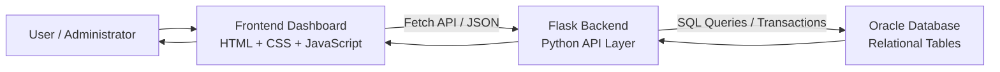
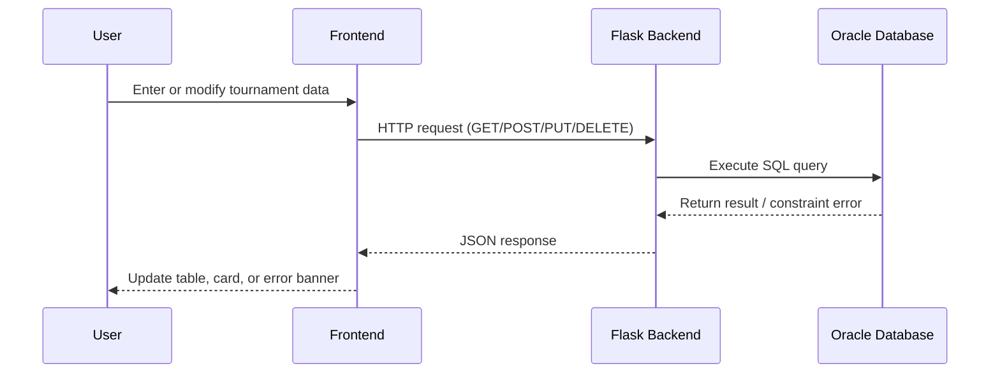
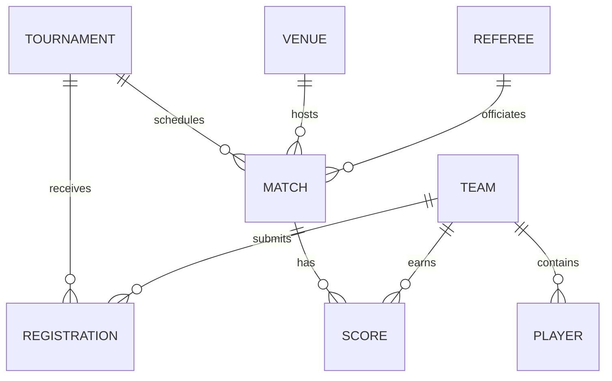
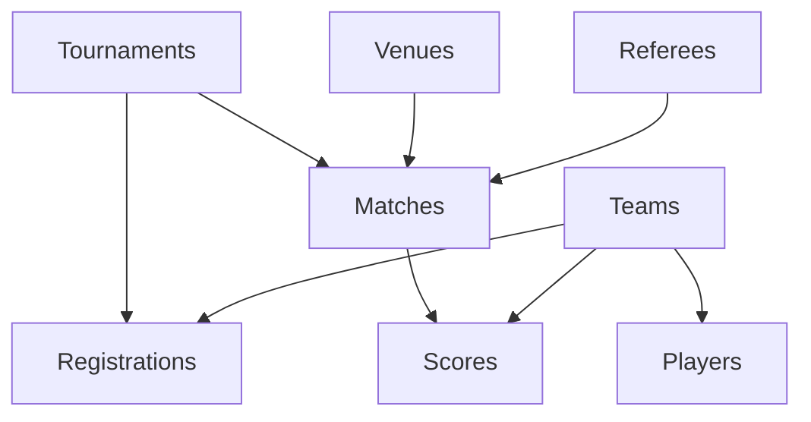
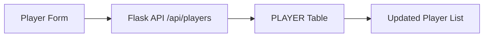
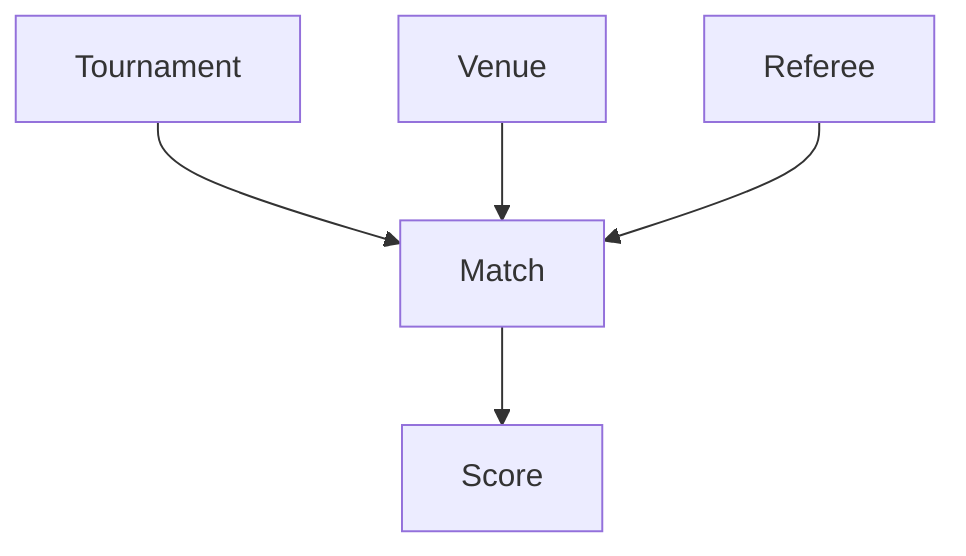

# BCSE302L - Database Systems

## Sports Tournament Management System

**Prepared by:** `[Your Name]`  
**Register Number:** `[Your Register Number]`  
**Course:** BCSE302L - Database Systems  
**Institution:** `[College / University Name]`  
**Guide / Faculty:** `[Faculty Name]`  
**Date:** March 29, 2026

---

## Table of Contents

1. Title and Name .................................................................. 1  
2. Abstract ........................................................................ 2  
3. Introduction .................................................................... 3  
4. Existing Work .................................................................... 5  
5. Proposed Work / System ........................................................ 7  
6. System Design / Architecture of Proposed Work ................................. 10  
7. Technology Stack ............................................................... 15  
8. Working Modules with Diagrams and Explanation ................................. 17  
9. Screenshots of Output .......................................................... 28  
10. Conclusion ................................................................... 31  
11. References ................................................................... 33  
12. Complete Implementation ....................................................... 35  

Note: Page numbers are indicative for report formatting in Word/PDF. They can be updated automatically after typesetting.

---

## Abstract

The Sports Tournament Management System is a database-driven web application developed to manage the operational workflow of sports tournaments in a centralized and structured manner. Tournament administration typically involves maintaining information about players, teams, tournaments, venues, referees, registrations, matches, and scores. In many academic projects and local sports organizations, this information is still handled using spreadsheets, handwritten logs, or loosely connected applications. Such approaches often result in duplication of data, poor consistency, difficulty in searching records, and the absence of proper relational integrity.

This project addresses those limitations by designing and implementing a full-stack system using Flask, Oracle Database, HTML, CSS, and JavaScript. The application follows a single-page dashboard model where the user can manage all core tournament entities through a unified interface. The system supports Create, Read, Update, and Delete operations for each major module, while the Oracle database enforces relationships between the entities through primary keys and foreign keys. This ensures that invalid data, such as assigning a player to a non-existent team or creating a score entry for a non-existent match, can be prevented at the database level.

The backend exposes modular REST-style API routes for each entity, while the frontend dynamically fetches and renders data without requiring full-page reloads. The application also includes validation-oriented error handling to convert database errors into more understandable messages for the user. The proposed system therefore combines usability, structured storage, and relational database design in a practical application that aligns well with the objectives of a Database Systems course.

From an academic perspective, this project demonstrates database schema design, normalization principles, table relationships, referential integrity, CRUD operations, transaction handling, and front-end to back-end integration. From a practical perspective, it provides a reusable foundation for real-world sports event management. The final system serves as a meaningful example of how database systems can support reliable and efficient information management in domain-specific applications.

---

## Introduction

Sports tournaments involve a large amount of structured and interdependent information. Even for a medium-sized event, administrators must track player enrollment, team composition, tournament details, venue capacity, referee assignments, team registrations, match schedules, and final scores. When this information is maintained manually, errors become common. Duplicate records, missing dependencies, poor retrieval speed, and inconsistent updates affect both efficiency and reliability.

The goal of this project is to build a Sports Tournament Management System that provides a centralized platform for storing, retrieving, and managing tournament-related data. The system is designed as a database application backed by Oracle Database and delivered through a web interface. It allows administrators to interact with the underlying database using a clean and modern dashboard rather than writing direct SQL queries for routine operations.

The project is important from both a software and database engineering perspective. At the software level, it demonstrates how a frontend and backend communicate through APIs to create a responsive user experience. At the database level, it shows how multiple related entities can be modeled in a relational form, with keys and constraints enforcing consistency. The use of Oracle also highlights enterprise-grade database practices, especially in handling constraints, transactions, and relational integrity.

### Objectives

The main objectives of the project are:

- To design a relational database for sports tournament management.
- To create a user-friendly dashboard for managing tournament data.
- To implement CRUD operations for all major entities.
- To maintain data integrity using primary keys, foreign keys, and constraints.
- To reduce manual effort in organizing tournament-related information.
- To demonstrate the practical use of database systems in a real application.

### Problem Statement

Manual or spreadsheet-based tournament management suffers from the following problems:

- No centralized storage for all tournament data.
- Difficulty maintaining relationships between players, teams, matches, and scores.
- Increased possibility of duplicate, invalid, or inconsistent records.
- Limited searchability and poor scalability.
- Time-consuming updates and reporting.

This project solves these issues by building a centralized, relational, and web-accessible system.

### Scope of the Project

The current implementation covers the following logical entities:

- Players
- Teams
- Tournaments
- Venues
- Referees
- Registrations
- Matches
- Scores

The system is intended primarily for administrative use. It does not currently implement public-facing features such as player login, audience dashboards, payment processing, or live broadcast integration. However, the architecture is modular enough to support such extensions in future work.

---

## Existing Work

Before proposing the current system, it is useful to understand the commonly used approaches for managing tournaments.

### 1. Manual Registers and Paper-Based Records

In many schools, colleges, and local clubs, tournament information is still maintained in notebooks or printed forms. This approach is simple and inexpensive but has major disadvantages:

- Records are difficult to search.
- Updates require rewriting or overwriting information.
- Relationships between entities are not enforced.
- Data may be lost, damaged, or duplicated.
- Reporting and summarization are cumbersome.

### 2. Spreadsheet-Based Management

Spreadsheet tools such as Microsoft Excel or Google Sheets are often used to maintain player and match information. These tools improve searchability and tabular storage, but they still have limitations:

- No real enforcement of relational constraints.
- Accidental deletion or modification can corrupt consistency.
- Cross-sheet dependencies are difficult to maintain.
- Large tournament datasets become difficult to manage.
- Multi-user coordination can become messy.

### 3. Generic Sports Management Platforms

There are commercial products for league and tournament management. These systems may offer advanced scheduling, registration, analytics, and user portals. However, for an academic or institution-level project, they introduce limitations:

- They may be expensive.
- The database design is not visible for study.
- They are not customizable for course-based learning.
- They do not help students understand backend and schema design.

### 4. Academic Project Prototypes

Many student projects in this area focus only on a subset of operations, such as team registration or score entry, and often do not maintain strong relationships between all entities. Some systems use local flat files or simplified databases without proper normalization.

### Limitations in Existing Approaches

Across these approaches, the common weaknesses are:

- Poor relational modeling
- Weak or absent validation
- Inconsistent user interfaces
- Lack of a unified architecture
- Limited extensibility

The proposed system improves on these by combining a structured Oracle schema, a dedicated backend, and an integrated dashboard interface.

---

## Proposed Work / System

The proposed work is a database-centered web application named the Sports Tournament Management System. It is designed to manage all important operational data required for organizing and running a sports tournament.

### Core Idea

The system acts as a centralized administrative platform where users can:

- Add, edit, view, and delete players
- Manage teams and team-related details
- Maintain tournaments and their metadata
- Register teams into tournaments
- Assign venues and referees
- Schedule matches
- Enter and update scores

### Key Functional Capabilities

#### 1. Centralized Data Management

All tournament-related data is stored in a single relational database system. This improves consistency and reduces duplication.

#### 2. Module-Based CRUD Operations

Each entity is treated as an independent module from the UI perspective, while still remaining linked through foreign key relationships in the database.

#### 3. Real-Time Dashboard Interaction

The frontend behaves like a single-page application. Navigation between sections happens without reloading the entire page, improving the user experience.

#### 4. Database Constraint Awareness

The backend interprets Oracle errors and returns user-friendly messages. This is especially useful when an operation violates a uniqueness rule or a foreign key dependency.

#### 5. Search and Administrative Usability

Each major section includes a search field for quickly locating records. This makes the system practical for actual administration rather than being only a proof of concept.

### Benefits of the Proposed System

- Better data integrity
- Faster record management
- Clear entity relationships
- Easier administration
- Improved scalability compared to manual methods
- Stronger academic value for studying database-driven applications

---

## System Design / Architecture of Proposed Work

The system follows a three-layer architecture:

1. Presentation Layer
2. Application Layer
3. Data Layer

### 1. Presentation Layer

This layer is implemented using:

- HTML
- CSS
- JavaScript

It provides the dashboard interface, navigation, forms, tables, search bars, KPI cards, and modal dialogs. The presentation layer does not directly communicate with the database. Instead, it sends requests to the backend APIs.

### 2. Application Layer

This layer is implemented in Python using Flask. It handles:

- API routing
- Request parsing
- CRUD operations
- Database communication
- Response formatting
- Error handling

The backend acts as the bridge between the UI and the Oracle database.

### 3. Data Layer

This layer consists of the Oracle relational database and the schema supporting the tournament entities. It is responsible for:

- Persistent storage
- Primary key and foreign key enforcement
- Data retrieval
- Transaction commits
- Constraint-based consistency

### High-Level Architecture Diagram



### Request-Response Flow



### Database Design Perspective

The logical model of the system contains eight major entities:

- Tournament
- Team
- Player
- Venue
- Referee
- Registration
- Match
- Score

These entities are interrelated. For example:

- A player belongs to a team.
- A team can register for a tournament.
- A tournament contains matches.
- A match is associated with a venue and a referee.
- A score belongs to a match and a team.

### Entity Relationship Diagram



### Important Design Considerations

#### Referential Integrity

The system relies on database-level relations so that dependent data cannot reference non-existent parent records.

#### Separation of Concerns

- HTML structures the content.
- CSS handles presentation and styling.
- JavaScript handles interaction and API communication.
- Flask handles business operations.
- Oracle stores persistent data.

#### Maintainability

The backend separates connection management into `db_config.py`, API logic into `app.py`, and schema setup into `schema.sql` and `setup_db.py`.

#### Scalability

Although this project is academic in scope, its architecture supports future expansion such as authentication, reports, scheduling automation, and analytics.

---

## Technology Stack

The project uses the following technologies.

### Frontend

#### HTML5

Used to define:

- Sidebar navigation
- Section containers
- Search bars
- Tables
- Buttons
- Forms
- Modal windows

#### CSS3

Used to create:

- Dark-mode dashboard styling
- Card-based layout
- Responsive design behavior
- Tables and toolbar styling
- Modal form styling
- Dashboard visual hierarchy

#### JavaScript

Used for:

- SPA-style navigation
- Fetching data from backend APIs
- Rendering tables dynamically
- Filtering table content
- Populating statistics cards
- Handling modal open/edit/delete flows

### Backend

#### Python

Used as the primary programming language because of its readability, rapid development support, and strong database ecosystem.

#### Flask

Used as the lightweight backend framework for:

- Routing
- Serving the main dashboard page
- Handling API requests
- Returning JSON responses

### Database

#### Oracle Database

Used because it is a robust relational database platform that supports:

- Primary keys
- Foreign keys
- Constraints
- Transaction handling
- Structured SQL processing

#### `oracledb` Python Driver

Used to establish database connectivity from Python to Oracle in thin mode.

### Development Utilities

- SQL scripts for schema creation
- Python setup scripts
- Local Flask development server
- Browser-based dashboard interaction

### Technology Summary Table

| Layer | Technology | Purpose |
|---|---|---|
| Frontend | HTML | Page structure |
| Frontend | CSS | Styling and layout |
| Frontend | JavaScript | Dynamic interaction |
| Backend | Python | Server-side logic |
| Backend | Flask | API and web server |
| Database | Oracle DB | Relational data storage |
| Database Access | `oracledb` | Python-Oracle connectivity |

---

## Working Modules with Appropriate Diagram and Explanation

The system contains eight functional modules. Together, these modules cover the complete tournament workflow.

### Overall Module Interaction Diagram



## 1. Player Management Module

### Purpose

This module stores and manages player details such as player ID, name, age, gender, position, and associated team.

### Input Fields

- Player ID
- Player Name
- Age
- Gender
- Position
- Team ID

### Functions

- Add player
- View player list
- Update player record
- Delete player record
- Search players

### Database Relevance

The `PLAYER` table contains a foreign key reference to the `TEAM` table, ensuring that a player is linked to a valid team.

### Flow Diagram



### Explanation

When an administrator submits player information through the form, the frontend sends the data to the `/api/players` route. The backend inserts it into the database. During retrieval, the frontend also resolves team names from team IDs for easier display.

---

## 2. Team Management Module

### Purpose

This module maintains team-related data such as team identity, coach name, city, and contact number.

### Input Fields

- Team ID
- Team Name
- Coach Name
- City
- Contact Number

### Functions

- Add team
- View teams
- Update team
- Delete team
- Search teams

### Explanation

Teams are foundational entities in the system. They are referenced by players, registrations, and scores. Therefore, team management is central to maintaining consistency across several modules.

---

## 3. Tournament Management Module

### Purpose

This module stores high-level tournament information.

### Input Fields

- Tournament ID
- Tournament Name
- Sport Type
- Start Date
- End Date
- Location
- Organizer Name

### Functions

- Add tournament
- Update tournament
- Delete tournament
- View tournament records
- Search tournaments

### Explanation

Every registration and match is linked to a tournament. This module allows the administrator to define the events that the rest of the system operates on.

---

## 4. Venue Management Module

### Purpose

This module stores information about venues where matches are conducted.

### Input Fields

- Venue ID
- Venue Name
- Location
- Capacity

### Functions

- Add venue
- Edit venue
- Delete venue
- View venue records
- Search venue records

### Explanation

Venues are required for match scheduling. A valid venue must exist before it can be assigned to a match.

---

## 5. Referee Management Module

### Purpose

This module stores details of referees responsible for officiating matches.

### Input Fields

- Referee ID
- Referee Name
- Experience Years
- Contact Number

### Functions

- Add referee
- Update referee
- Delete referee
- View referees
- Search referees

### Explanation

Referee assignment is an essential operational step in tournament organization. This module ensures that the match scheduling module can select referees from valid stored records.

---

## 6. Registration Module

### Purpose

This module records which team is registered in which tournament and on what date.

### Input Fields

- Registration ID
- Registration Date
- Tournament ID
- Team ID

### Functions

- Add registration
- Update registration
- Delete registration
- View registrations
- Search registrations

### Explanation

This module acts as a bridge between tournaments and teams. It represents participation information and reflects a common many-to-many relationship resolved through an associative table.

---

## 7. Match Management Module

### Purpose

This module schedules individual matches for tournaments.

### Input Fields

- Match ID
- Tournament ID
- Match Date
- Match Time
- Match Type
- Venue ID
- Referee ID

### Functions

- Add match
- Update match
- Delete match
- View match list
- Search matches

### Explanation

This module connects multiple entities:

- Tournament
- Venue
- Referee

It is therefore one of the most relationally important modules in the system.

### Match Scheduling Diagram



---

## 8. Score Management Module

### Purpose

This module stores scoring information and result status for each team in a match.

### Input Fields

- Score ID
- Match ID
- Team ID
- Points Scored
- Result Status

### Functions

- Add score
- Update score
- Delete score
- View scores
- Search score entries

### Explanation

This is the final outcome-oriented module. It depends on valid match and team records. It is essential for result tracking and can serve as the basis for future ranking logic.

---

## Backend Working Logic

The backend in `app.py` defines separate API groups for each entity. The main implementation pattern is:

1. Receive request from frontend
2. Read JSON payload if needed
3. Open Oracle connection
4. Execute SQL statement
5. Commit transaction for write operations
6. Return JSON response
7. Parse database errors into user-friendly output where possible

### Error Handling Design

One important feature in the backend is centralized Oracle error interpretation. The helper method translates common database constraint violations such as:

- Duplicate primary key entries
- Check constraint violations
- Missing referenced parent rows
- Delete restriction due to dependent rows

This makes the application more user-friendly and demonstrates how database exceptions can be surfaced in an understandable manner.

---

## Screenshots of Output

The current repository does not include embedded screenshot files in a report-ready folder, so this section is prepared as a structured template. While finalizing the report, insert screenshots captured from the running application under each subsection.

### Screenshot 1: Main Dashboard Home

Insert screenshot showing:

- Sidebar navigation
- Header section
- KPI cards
- Player table

**Caption:** Main dashboard showing player management overview.

### Screenshot 2: Team Management Section

Insert screenshot showing:

- Teams table
- Search field
- Refresh button

**Caption:** Team management interface for viewing and maintaining team records.

### Screenshot 3: Add / Edit Modal Form

Insert screenshot showing:

- Modal form for adding or editing an entity
- Example: Add Player or Add Match

**Caption:** Modal-based data entry form used for CRUD operations.

### Screenshot 4: Tournament or Match Management Screen

Insert screenshot showing:

- Tournament list or match list
- Data arranged in tabular form

**Caption:** Tournament or match scheduling interface.

### Screenshot 5: Score Management Screen

Insert screenshot showing:

- Score records
- Result status field

**Caption:** Score entry and result management screen.

### Screenshot 6: Error Handling Example

Insert screenshot showing:

- User-friendly error banner after an invalid action

**Caption:** Validation feedback shown to the user when a database constraint is violated.

---

## Conclusion

The Sports Tournament Management System successfully demonstrates how database system concepts can be applied to solve a real administrative problem. Through this project, tournament information that would otherwise be scattered across notebooks or spreadsheets is organized into a structured Oracle-backed relational system. The application supports all major operations necessary for tournament administration, including management of players, teams, tournaments, venues, referees, registrations, matches, and scores.

From a database perspective, the project highlights the practical use of relational modeling, key constraints, entity relationships, data integrity, and transaction-based CRUD workflows. From a software engineering perspective, it shows how a Flask backend can expose modular APIs and how a JavaScript frontend can consume them to deliver a smooth, responsive interface.

The project meets the main objectives of centralized record handling, improved consistency, and easy administrative interaction. It also creates a strong foundation for future improvements such as authentication, analytics dashboards, automated bracket generation, ranking calculation, scheduling intelligence, and exportable reports.

In conclusion, the system is both academically meaningful and practically relevant. It illustrates the importance of database design in real applications and demonstrates how a well-structured database can become the backbone of a complete software solution.

---

## References

1. Flask Documentation. Pallets Projects.  
   https://flask.palletsprojects.com/

2. Python `oracledb` Driver Documentation.  
   https://python-oracledb.readthedocs.io/

3. Oracle Database Documentation.  
   https://www.oracle.com/database/

4. MDN Web Docs - HTML, CSS, JavaScript.  
   https://developer.mozilla.org/

5. Elmasri, R., and Navathe, S. B. Fundamentals of Database Systems.

6. Silberschatz, A., Korth, H. F., and Sudarshan, S. Database System Concepts.

---

## Complete Implementation

This section documents the implementation components used in the project.

### Project Structure

```text
sports-tournament-manager/
|-- app.py
|-- db_config.py
|-- schema.sql
|-- setup_db.py
|-- requirements.txt
|-- templates/
|   `-- index.html
`-- static/
    |-- css/
    |   `-- style.css
    `-- js/
        `-- main.js
```

### 1. `app.py` - Main Flask Application

Responsibilities:

- Serves the dashboard page
- Defines API endpoints for all modules
- Processes GET, POST, PUT, and DELETE operations
- Connects frontend requests to Oracle operations
- Handles user-friendly database error reporting

Logical API coverage:

- `/api/players`
- `/api/teams`
- `/api/tournaments`
- `/api/venues`
- `/api/referees`
- `/api/registrations`
- `/api/matches`
- `/api/scores`

### 2. `db_config.py` - Database Connectivity

Responsibilities:

- Establishes Oracle connection
- Centralizes DB credentials and DSN configuration
- Keeps database access logic separate from route logic

Suggested improvement for production:

- Move credentials to environment variables instead of hardcoding them.

### 3. `schema.sql` - Database Schema Script

Responsibilities:

- Drops existing tables for clean initialization
- Creates entity tables
- Defines foreign key constraints
- Commits schema changes

### 4. `setup_db.py` - Database Setup Utility

Responsibilities:

- Executes schema creation statements through Python
- Provides programmatic initialization support

### 5. `templates/index.html` - Dashboard Structure

Responsibilities:

- Builds sidebar and section containers
- Defines toolbar, table, and modal structure
- Holds all section placeholders for the SPA-like interface

### 6. `static/js/main.js` - Frontend Application Logic

Responsibilities:

- Section switching
- API calls
- Dynamic table rendering
- Search filtering
- Stats card rendering
- Modal opening and editing
- Delete confirmation handling

### 7. `static/css/style.css` - User Interface Styling

Responsibilities:

- Dark dashboard theme
- Sidebar styling
- Card-based layout
- Search and table polish
- Modal and responsive behavior

### Sample CRUD Pattern Used in the Backend

The application repeatedly follows this pattern:

```python
@app.route("/api/entity", methods=["POST"])
def add_entity():
    data = request.get_json()
    conn = get_db_connection()
    with conn.cursor() as cursor:
        cursor.execute("INSERT INTO ...", {...})
    conn.commit()
    return jsonify({"message": "Record added successfully."}), 201
```

This demonstrates:

- Request parsing
- Database connection
- Parameterized SQL
- Transaction commit
- JSON response generation

### SQL Design Highlights

The implementation demonstrates the following database principles:

- Primary keys for unique identification
- Foreign keys for inter-table relationships
- Associative entity design for registrations
- Transactional write operations
- Structured query handling through SQL

### Future Enhancements

Possible future improvements include:

- Login and role-based access control
- Tournament bracket generation
- Team ranking and leaderboard computation
- Export to PDF or Excel
- Audit logs for changes
- Dashboard analytics and charts
- Mobile-first optimization
- Pagination for very large datasets

### Final Implementation Note

The full implementation is present in the project source files. This report documents the architecture and design in detail, while the repository contains the executable system.

---

## Appendix: Suggested Final Formatting Before Submission

Before submitting the report, you may want to:

- Replace placeholder student details on the title page
- Insert real screenshots into the screenshot section
- Export this report to Word or PDF for final page numbering
- Add institution logo if required by your department
- Apply your department's font, margin, and spacing guidelines
